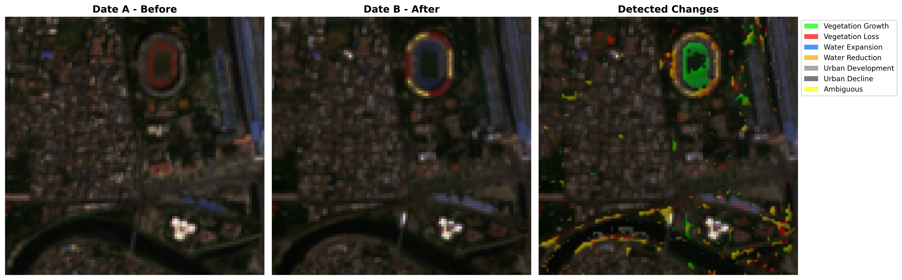
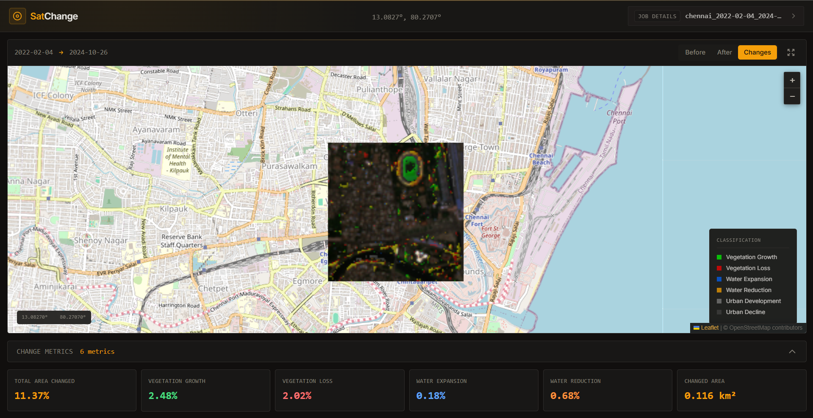

# SatChange


SatChange is a Python CLI that compares how a place changed between two dates using Sentinel-2 imagery from Google Earth Engine. It turns raw satellite bands into practical outputs you can share: a static change map, a GeoTIFF, summary statistics, and a local web viewer URL with map layers.

If you track urban growth, vegetation loss, or water change, SatChange gives you a reproducible workflow with AOI-local cloud checks, fallback date recovery, and cached downloads to reduce repeated work.




## Table of Contents

- [Why SatChange](#why-satchange)
- [What you get](#what-you-get)
- [Quick start](#quick-start)
- [Demo artifacts (verified)](#demo-artifacts-verified)
- [Outputs](#outputs)
- [Web viewer flow](#web-viewer-flow)
- [Quality checks](#quality-checks)
- [Packaging notes](#packaging-notes)
- [Security notes](#security-notes)
- [FAQ](#faq)
- [Documentation map](#documentation-map)
- [Contributing](#contributing)
- [License](#license)

## Why SatChange

Satellite images are useful, but comparing dates manually is slow and hard to reproduce. SatChange automates that process for a target area of interest (AOI), then packages the result in both analyst-friendly and stakeholder-friendly forms.

### Problem it solves

- Picking usable scenes is difficult when cloud cover varies by location.
- Raw imagery alone does not explain what changed.
- Sharing results across technical and non-technical teams is often manual.

### How SatChange solves it

- Uses **AOI-local cloud quality** checks (not scene metadata alone).
- Applies **fallback strategies** when requested dates are too cloudy.
- Produces **versionable artifacts** (`.npz`, `.npy`, `.json`, `.png`, `.tif`) plus a **JobID manifest** for the web viewer.

## What you get

- Spectral change detection with NDVI (vegetation), NDWI (water), and NDBI (urban)
- Stable change classes (`0..7`) across processing and visualization
- Disk LRU cache to avoid redundant downloads
- Dry-run mode for safe validation without network calls
- Web-first output (`job_id`, `manifest`, `/jobs/<job_id>` URL hint)
- Optional legacy interactive HTML export for compatibility

## Quick start

### 1) Install

```bash
git clone https://github.com/Rogit-28/GEE-Temporal-Analysis.git
cd GEE-Temporal-Analysis
python -m venv venv
# Windows PowerShell:
.\venv\Scripts\Activate.ps1
# macOS/Linux:
# source venv/bin/activate
pip install -r requirements.txt
pip install -e .
# Maintainer/QA tooling (lint, type-check, tests):
pip install -r requirements-dev.txt
```

### 2) Verify CLI

```bash
python -m satchange --help
satchange --help
satchange --version
```

### 3) Configure Earth Engine

```bash
satchange config init --service-account-key /path/to/key.json --project-id your-project-id
satchange config show
```

`config init` copies your key to `~/.satchange/keys/` and stores that managed path in `~/.satchange/config.yaml`.

### 4) Dry-run first (no network calls)

```bash
satchange analyze --center "13.0827,80.2707" --size 100 --date-a "2022-02-04" --date-b "2024-10-26" --change-type all --output ./results --dry-run
```

### 5) Run analysis and export

```bash
satchange analyze --center "13.0827,80.2707" --size 100 --date-a "2022-02-04" --date-b "2024-10-26" --change-type all --output ./results --name chennai --non-interactive
satchange export --result ./results --format all
```

## Demo artifacts (verified)

The following demo evidence was generated from this repository and stored in `docs/assets/`.

### A) Dry-run output (happy path)

Command:

```bash
satchange analyze --center "13.0827,80.2707" --size 100 --date-a "2022-02-04" --date-b "2024-10-26" --change-type all --output ./results --dry-run
```

Output excerpt (`docs/assets/demo-dry-run-output.txt`):

```text
[DRY RUN] Local validation complete.
  Cloud checks skipped (no network calls in dry-run mode).
  Planned output prefix: 13.0827_80.2707_2022-02-04_2024-10-26

[DRY RUN] Would execute the following:
  Download images for dates: 2022-02-04, 2024-10-26
  Area: 100x100 pixels at (13.0827, 80.2707)
```

### B) Edge case: inspect without auth

Command (explicit empty config):

```bash
satchange --config-file <empty-config.yaml> inspect --center "13.0827,80.2707" --size 100 --date-range "2022-01-01:2022-12-31"
```

Output (`docs/assets/demo-missing-auth-output.txt`):

```text
[ERROR] Not authenticated with Google Earth Engine
Run 'satchange config init' first
```

### C) Export + web manifest generation

Command:

```bash
satchange export --result ./results --format all --include-legacy-html
```

Output excerpt (`docs/assets/demo-export-output.txt`):

```text
[OK] Visualization generation completed!
Generated files:
  static: ..._visualization.png
  geotiff: ..._classification.tif
  web_manifest: ..._web_bundle\manifest.json
  job_id: chennai_2022-02-04_2024-10-26-bc28dac04a0d
  web_url_hint: http://localhost:3000/jobs/chennai_2022-02-04_2024-10-26-bc28dac04a0d
```

## Outputs

SatChange writes artifacts with prefix `{name_or_lat_lon}_{date_a}_{date_b}`.

| Artifact | Purpose |
|---|---|
| `{prefix}_bands_a.npz`, `{prefix}_bands_b.npz` | Band arrays (pickle-free) |
| `{prefix}_classification.npy` | Change classification map |
| `{prefix}_change_stats.json` | Statistics for classes and totals |
| `{prefix}_metadata.json` | Run metadata and processing summary |
| `{prefix}_visualization.png` | Static comparison map |
| `{prefix}_classification.tif` | GeoTIFF for GIS workflows |
| `{prefix}_job.json` | Job index (`job_id`, manifest path) |
| `{prefix}_web_bundle/manifest.json` | Web manifest for Next.js job viewer |
| `{prefix}_interactive.html` | Legacy interactive output (opt-in) |

## Web viewer flow

`analyze` and `export` emit a `job_id` and attempt a best-effort local viewer start.

```bash
cd web
npm install
# PowerShell:
$env:SATCHANGE_RESULTS_DIR = "C:\path\to\results"
npm run build
npm run dev:reset
```

Open:

```text
http://localhost:3000/jobs/<job_id>
http://localhost:3000/api/jobs/<job_id>
```

If the CLI prints `web_viewer: not started (...)`, run the manual command it prints.

## Quality checks

Validated locally from repository root:

```bash
black --check satchange examples
flake8 satchange examples
mypy satchange
pytest -q
cd web && npm run build
```

Latest local baseline in this repo:

- `black --check`: pass
- `flake8`: pass
- `mypy`: pass
- `pytest`: pass (`10 passed`)
- `web build`: pass

## Packaging notes

- Package metadata is defined in `setup.py` (`name=satchange`, `version=1.0.0a1`).
- CLI entrypoint is `satchange=satchange.cli:main`.
- Install path verified locally with editable install (`pip install -e .`).

## Security notes

- Never commit service-account keys.
- `satchange config init` stores a managed local key copy under `~/.satchange/keys/`.
- Output names are sanitized (`sanitize_output_name`) and file paths are confined (`safe_join`).
- Legacy pickled band dictionaries (`*_bands_*.npy`) are intentionally unsupported by `export`.

## FAQ

### Does dry-run contact Earth Engine?

No. `--dry-run` validates local inputs and exits before imagery download or change detection.

### What if my requested dates are too cloudy?

SatChange attempts threshold relaxation, temporal window expansion, then median compositing.

### Why does `inspect` use scene cloud while `analyze` focuses on local cloud?

`inspect` is a quick catalog preview. `analyze` makes AOI-specific quality decisions using local cloud coverage.

### Is legacy interactive HTML still available?

Yes, but opt-in only via `--include-legacy-html`.

### Where should I start for full command docs?

Use [API_REFERENCE.md](API_REFERENCE.md).

## Documentation map

- [RUN_INSTRUCTIONS.md](RUN_INSTRUCTIONS.md) — setup, commands, troubleshooting, release checklist
- [API_REFERENCE.md](API_REFERENCE.md) — CLI command and option reference
- [`examples/`](examples) — programmatic examples (mock/demo-oriented)

## Contributing

See [CONTRIBUTING.md](CONTRIBUTING.md).

## License

MIT — see [LICENSE](LICENSE).
